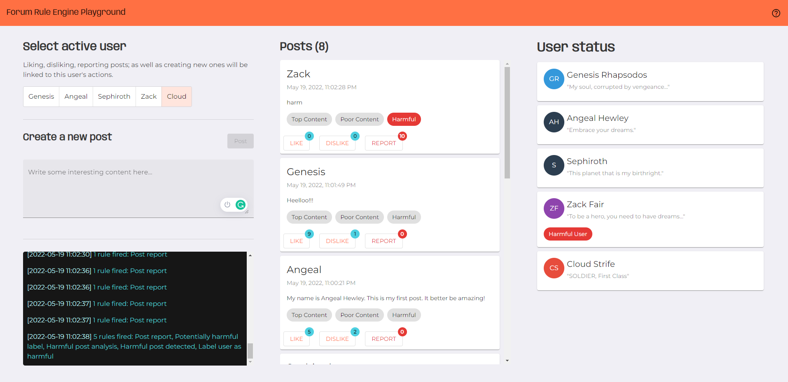

# Forum Rule Engine
## Sistem za upravljanje korisnicima i objavama na forumu

Sistem za upravljanje **korisnicima** i **objavama** na forumima rešio bi problem mnogih socijalnih platformi koje u svom opisu imaju deljenje tekstualnog sadržaja. Glavni zadatak iz aspekta objava jeste da se uoče trending objave, ali i isprate one koje su potencijalno štetne za zajednicu i odreaguje pravilno. Sa druge strane, imamo korisnike, čije se ponašanje može ili nagraditi određenim bedževima/tokenima, ili kazniti restrikcijom aktivnosti (odnosno, suspenzijom naloga u krajnjem slučaju).

### Specifikacija projekta

Detaljnu specifikaciju po kojoj je sistem izgrađen, kao i listu pravila koje podržava možete pogledati u fajlu  [**Forum user and post management - Specification.pdf**](https://github.com/tara-pogancev/forum-rule-engine/blob/main/Forum%20user%20and%20post%20management%20-%20Specification.pdf)

## Pokretanje sistema

**Frontend - Angular Aplikacija**: `ng serve`

**drools-spring-kjar**: U okviru Eclipse okruženja pokrenuti `Maven Clean` a potom `Maven Install`. Novokreirani JAR fajl `drools-spring-kjar-0.0.1-SNAPSHOT.jar` potrebno je dodati kao *Library* u sklopu Java Build Path-a Spring aplikacije (*drools-spring-app*).

**drools-spring-app**: Locirati main funkciju i pokrenuti je kao Spring aplikaciju u okviru Eclipse EE 2018-09 okruženja.

## Slike ekrana

